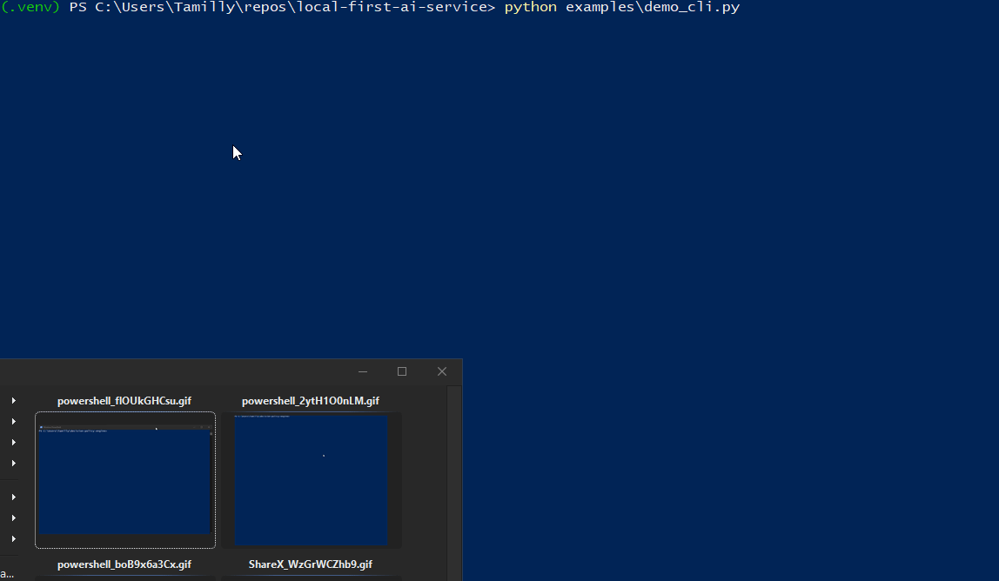
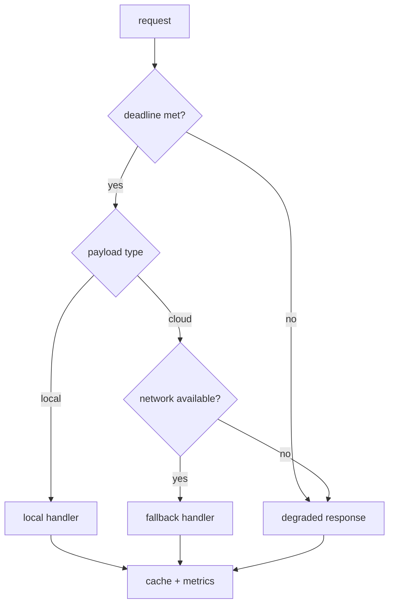

# local-first-ai-service

**Portfolio Note (Safe-to-Publish):** This repository is a public, generic demonstration and does not disclose proprietary architectures, algorithms, or patent-related material.

[](https://github.com/rafaellimatecnologia-cloud/local-first-ai-service/actions/workflows/ci.yml)
[](https://github.com/rafaellimatecnologia-cloud/local-first-ai-service)
[](https://github.com/rafaellimatecnologia-cloud/local-first-ai-service/blob/main/LICENSE)
[](https://github.com/rafaellimatecnologia-cloud/local-first-ai-service)
[](https://github.com/rafaellimatecnologia-cloud/local-first-ai-service)
[](https://github.com/rafaellimatecnologia-cloud/local-first-ai-service)
[](https://github.com/rafaellimatecnologia-cloud/local-first-ai-service)

A local-first service that deterministically routes by deadline, degrades safely under constraints, and emits audit-ready metrics without calling external APIs.

## Demo (3 seconds)



> Note: The demo GIF is uploaded manually outside this PR.

## Why this matters

- Keeps data, latency, and failure modes local by default.
- Makes routing decisions reproducible for audits and incident reviews.
- Degrades safely with clear, predictable outcomes under constraints.

## Architecture - Local-first decision flow



## Behavior

- **Local:** deterministic in-process handler.
- **Fallback:** deterministic alternate route when network is available.
- **Degraded:** minimal response when constraints are violated.
- See: [Policy Model (SLO-aware routing)](docs/POLICY_MODEL.md)
## Observability

Metrics capture per-request latency and export JSON snapshots with p50/p95 to support audits and tests.

## What this demonstrates

- Deterministic routing and deadline enforcement.
- Local-first execution with explicit fallback rules.
- Graceful degradation when constraints fail.
- Cache-aware latency and audit metrics.
- Fully testable, offline-friendly behavior.

## Use cases

- Edge runtimes needing strict latency budgets.
- Deterministic routing for regulated workloads.
- Local-first agents with predictable failure modes.

## Quickstart

```bash
pip install -e .
pip install pytest ruff pyright
python examples/demo_cli.py
pytest
```

## License

MIT License. See [LICENSE](https://github.com/rafaellimatecnologia-cloud/local-first-ai-service/blob/main/LICENSE).
