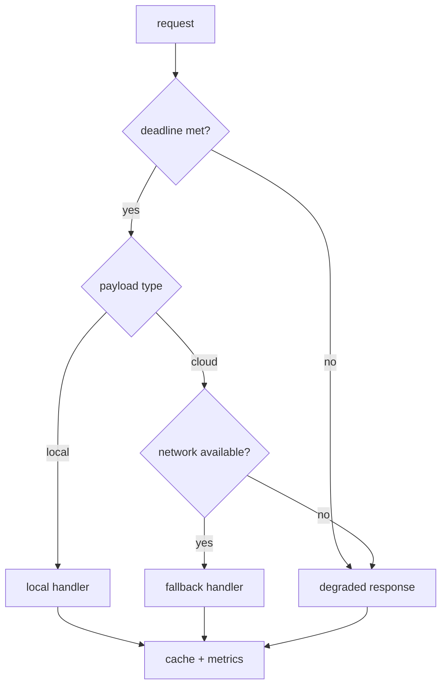

# local-first-ai-service

**Portfolio Note (Safe-to-Publish):** This repository is a public, generic demonstration and does not disclose proprietary architectures, algorithms, or patent-related material.

[](https://github.com/rafaellimatecnologia-cloud/local-first-ai-service/actions/workflows/ci.yml)
[](https://github.com/rafaellimatecnologia-cloud/local-first-ai-service)
[](https://github.com/rafaellimatecnologia-cloud/local-first-ai-service/blob/main/LICENSE)
[](https://github.com/rafaellimatecnologia-cloud/local-first-ai-service)
[](https://github.com/rafaellimatecnologia-cloud/local-first-ai-service)
[](https://github.com/rafaellimatecnologia-cloud/local-first-ai-service)
[](https://github.com/rafaellimatecnologia-cloud/local-first-ai-service)

A local-first service that deterministically routes by deadline, degrades safely under constraints, and emits audit-ready metrics without calling external APIs.

## Demo (3 seconds)


> If the image is missing, add it via GitHub upload in a follow-up commit.

### How to record the demo GIF (Windows/macOS/Linux)

1. Run `python examples/demo_cli.py` to produce deterministic output.
2. Record a 3–5 second clip of the terminal:
   - **Windows:** Xbox Game Bar (Win+G) screen capture.
   - **macOS:** QuickTime Player → New Screen Recording.
   - **Linux:** GNOME Screen Recorder (Shift+Ctrl+Alt+R) or your preferred local recorder.
3. Export the clip as `docs/assets/demo.gif`.

## Why this matters

- Keeps latency, data, and failure modes local by default.
- Makes routing decisions reproducible for audits and incident reviews.
- Degrades safely with clear metrics when constraints are violated.

## Architecture — Local-first decision flow



## What this demonstrates

- Deterministic routing and deadline enforcement.
- Local-first execution with explicit fallback rules.
- Graceful degradation when constraints fail.
- Cache-aware latency and audit metrics.
- Fully testable, offline-friendly behavior.

## Use cases

- Edge runtimes needing strict latency budgets.
- Deterministic routing for regulated workloads.
- Local-first agents with predictable failure modes.

## Quickstart

```bash
pip install -e ".[dev]"
python examples/demo_cli.py
pytest
```

## License

MIT License. See [LICENSE](https://github.com/rafaellimatecnologia-cloud/local-first-ai-service/blob/main/LICENSE).
